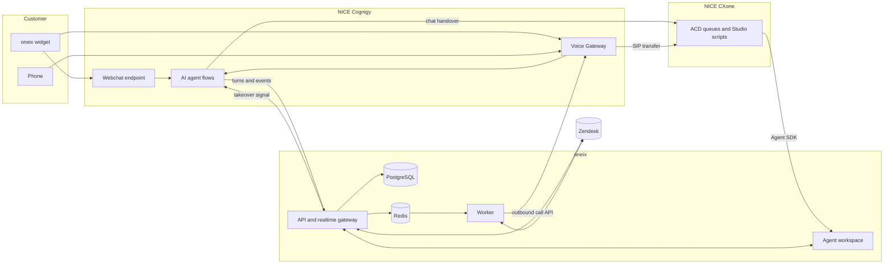
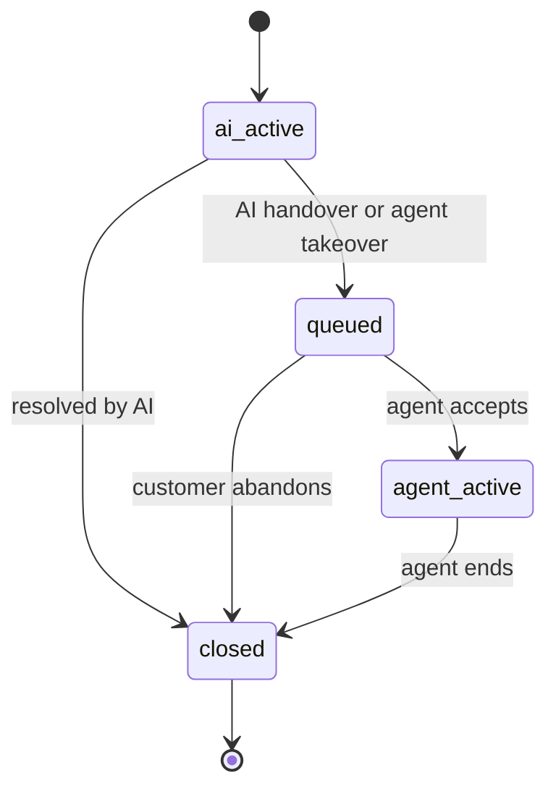
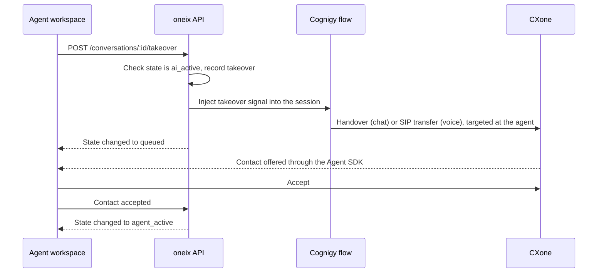

# Architecture (MVP)

## Components

## Responsibilities

| Component | Owns |
|---|---|
| **Widget** (`apps/widget`) | Loads chat and click-to-call on the client's website under oneix branding |
| **Cognigy** | AI conversation logic, speech, knowledge, and the decision to hand over |
| **CXone** | Queues, agent availability, call and chat delivery to human agents |
| **API** (`apps/api`) | Conversation state, ticket operations, takeover, webhooks, realtime events |
| **Worker** (`apps/worker`) | Scheduled outbound calls, retries, ticket sync, transcript flush |
| **Agent workspace** (`apps/web`) | Inbox, ticket view, live view, softphone, agent state |
| **Zendesk** | Ticket and customer records |

## Principles

- **Zendesk is the source of truth for tickets.** Ticket detail, views, and search are read from Zendesk live. oneix keeps a ticket cache, updated from webhooks, to link tickets to conversations. See [08-zendesk-workspace.md](08-zendesk-workspace.md).
- **Each tenant has its own Zendesk.** Every Zendesk call is made with the tenant's own connection.
- **oneix is the source of truth for conversations.** Conversation state, transcript, and handover history live in oneix's database.
- **Live conversations run in Cognigy and CXone. Records land in Zendesk.** Zendesk is never in the live path.
- **Every vendor sits behind an adapter package.** The API talks to `@oneix/ticketing`, `@oneix/cognigy`, and `@oneix/cxone`, never to vendor APIs directly.
- **One correlation ID.** `conversationId` is created by oneix and carried through Cognigy, CXone, and Zendesk.

## Conversation states

## Key flows

### 1. Inbound chat or web call, handled by AI

1. Customer opens the widget and starts a chat or call.
2. The Cognigy flow calls oneix: conversation started.
3. oneix creates the conversation, finds or creates the customer, and finds or creates the ticket in Zendesk.
4. The flow posts each turn to oneix. oneix stores it and pushes it to the Live view.
5. On resolution, the flow calls oneix: conversation ended, with a summary.
6. The worker writes the transcript and summary to the ticket.

### 2. AI hands over to an agent

**Chat**

1. The flow reaches a Handover to Human Agent node that uses the CXone handover provider.
2. The flow tells oneix that handover was requested. State becomes `queued`.
3. CXone routes the chat to an available agent.
4. The workspace receives the contact through the CXone Agent SDK, reads `conversationId`, and opens the ticket and transcript.
5. The agent accepts. State becomes `agent_active`.

**Voice**

1. The flow reaches a Transfer node. Voice Gateway transfers the call to CXone over SIP, carrying `conversationId` in a custom SIP header.
2. The flow tells oneix that handover was requested. State becomes `queued`.
3. The CXone Studio script reads the header and routes the call to a queue.
4. The agent's softphone rings in the workspace. On accept, the ticket and transcript open.

### 3. Agent takes over a live AI conversation

Routing a takeover to the specific agent who clicked the button depends on CXone configuration. See open items in the roadmap doc.

### 4. Scheduled outbound AI call

1. Agent schedules a call from a ticket: customer, time, purpose.
2. The API stores an outbound call record and enqueues a delayed job.
3. At the scheduled time, the worker requests the call from the Voice Gateway API with a status callback URL.
4. Voice Gateway reports status to oneix: ringing, in progress, completed, or no answer.
5. If answered, the AI flow runs with the ticket context. Handover and takeover work as in flows 2 and 3.
6. If not answered, the worker retries up to the limit.
7. The final outcome is written to the ticket.

## API surface (MVP)

### Workspace API

| Method | Path | Purpose |
|---|---|---|
| GET | `/tickets` | List tickets with filters |
| GET | `/tickets/:id` | Ticket with conversation thread |
| PATCH | `/tickets/:id` | Update status, priority, assignee |
| POST | `/tickets/:id/comments` | Public reply (emailed to the customer) or internal note, optionally changing the status |
| GET | `/conversations` | List conversations, filter by state |
| GET | `/conversations/:id` | Conversation with transcript |
| POST | `/conversations/:id/takeover` | Agent takeover |
| POST | `/conversations/:id/accepted` | Agent accepted the contact |
| POST | `/conversations/:id/turns` | Workspace logs agent and customer messages during the human leg |
| POST | `/outbound-calls` | Schedule an outbound AI call |
| GET | `/outbound-calls` | List scheduled and past calls |
| DELETE | `/outbound-calls/:id` | Cancel a scheduled call |

### Webhooks into oneix

| Path | Sender | Purpose |
|---|---|---|
| `/webhooks/cognigy/conversation-started` | Cognigy flow | Create conversation and ticket |
| `/webhooks/cognigy/turn` | Cognigy flow | Store and stream one transcript turn |
| `/webhooks/cognigy/handover-requested` | Cognigy flow | Move to `queued` |
| `/webhooks/cognigy/conversation-ended` | Cognigy flow | Close and trigger the ticket write |
| `/webhooks/voice-gateway/call-status` | Voice Gateway | Outbound call status |
| `/webhooks/zendesk/ticket-updated` | Zendesk | Refresh the ticket cache |

### Realtime events to the workspace

`conversation.started`, `conversation.turn`, `conversation.state_changed`, `ticket.updated`, `outbound_call.status_changed`

## Cross-cutting

- **Idempotency:** every webhook is stored by its event key before processing, and duplicates are ignored.
- **Webhook security:** shared secret or signature check per sender.
- **Failure handling:** vendor calls from webhooks are queued, retried with backoff, and logged on final failure.
- **Tenancy:** multiple tenants from the start. Every table carries `tenantId`, every request is scoped to the signed-in agent's tenant, and each tenant has its own Zendesk connection.
