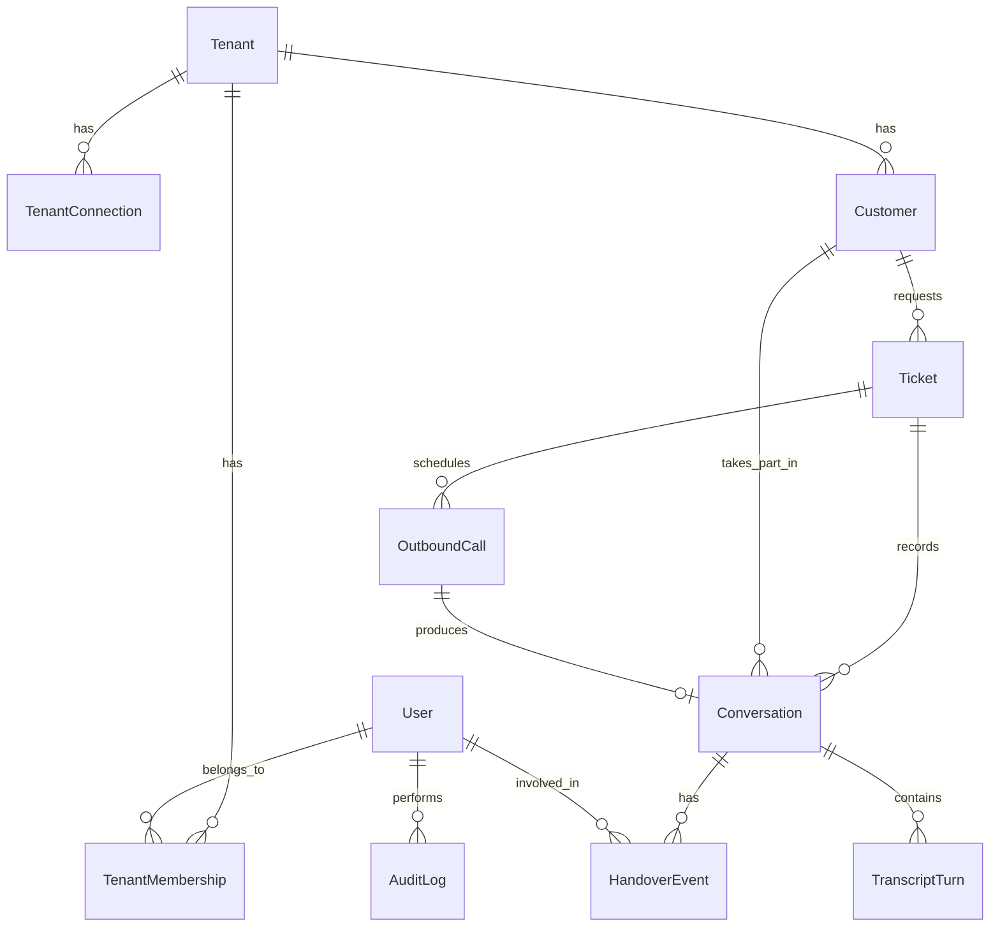

# Data model (MVP)

PostgreSQL through Prisma, defined in `packages/db`. Every table carries `createdAt` and `updatedAt`. Every table except `Tenant` and `User` carries `tenantId`, and the API reads them through a tenant-scoped client (`scopedToTenant`) that filters every query by tenant.

## Diagram

## Entities

### Tenant

| Field | Notes |
|---|---|
| `id`, `name` | One row per client |
| `slug` | URL-safe name, used in webhook URLs and sign-in |
| `settings` | JSON: retry rule, business timezone |

### TenantConnection

A tenant's connection to a vendor platform. One Zendesk connection per tenant.

| Field | Notes |
|---|---|
| `id`, `provider` | `zendesk` for now |
| `subdomain` | Zendesk subdomain |
| `authType` | `access_token`, `api_token`, `oauth_client` |
| `credentials` | Encrypted at rest |
| `webhookSecret` | Encrypted at rest |
| `status` | `active`, `disabled`, `failing` |

### User

A person who signs in to oneix. Not tied to a tenant: one person can work for several clients.

| Field | Notes |
|---|---|
| `id`, `name` | |
| `email` | Unique |
| `ssoSubject` | Subject from the identity provider |

### TenantMembership

A user's access to one tenant, with their identities in that tenant's platforms. Provisioned from the tenant's Zendesk agents.

| Field | Notes |
|---|---|
| `id`, `userId` | |
| `role` | `agent`, `admin`, from the Zendesk role |
| `zendeskUserId` | The agent in this tenant's Zendesk. Unique per tenant |
| `cxoneAgentId` | The agent in this tenant's CXone |
| `active` | False when the agent was removed or suspended in Zendesk |

### Customer

| Field | Notes |
|---|---|
| `id`, `name`, `email`, `phone` | Phone in E.164 format |
| `externalId` | Customer ID in the ticketing backend |

### Ticket

A cache of the ticketing backend's ticket. Zendesk remains the source of truth.

| Field | Notes |
|---|---|
| `id` | oneix ticket ID, shown in the workspace |
| `externalId` | Ticket ID in the ticketing backend |
| `customerId`, `assigneeId` | |
| `subject`, `status`, `priority` | |
| `lastSyncedAt` | Last refresh from the backend |

### Conversation

One chat or call session.

| Field | Notes |
|---|---|
| `id` | The `conversationId` used for correlation |
| `ticketId`, `customerId` | |
| `channel` | `chat`, `voice` |
| `direction` | `inbound`, `outbound` |
| `state` | `ai_active`, `queued`, `agent_active`, `closed` |
| `cognigySessionId`, `cognigyUserId` | Needed for the takeover signal |
| `cxoneContactId` | Set when an agent accepts |
| `agentId` | Agent who handled it, if any |
| `summary` | AI summary at the end |
| `closeReason` | `resolved_by_ai`, `resolved_by_agent`, `abandoned`, `failed` |
| `startedAt`, `endedAt` | |

### TranscriptTurn

| Field | Notes |
|---|---|
| `id`, `conversationId` | |
| `sender` | `customer`, `ai`, `agent`, `system` |
| `text` | |
| `sequence` | Order within the conversation |
| `occurredAt` | |

### HandoverEvent

| Field | Notes |
|---|---|
| `id`, `conversationId` | |
| `type` | `ai_handover`, `agent_takeover` |
| `reason` | From the AI, or blank for takeover |
| `requestedById` | Agent, for takeover |
| `acceptedById`, `acceptedAt` | |

### OutboundCall

| Field | Notes |
|---|---|
| `id`, `ticketId`, `customerId` | |
| `purpose` | Short text passed to the AI flow |
| `scheduledAt` | |
| `status` | `scheduled`, `dialing`, `in_progress`, `completed`, `no_answer`, `failed`, `cancelled` |
| `attempts`, `maxAttempts` | |
| `lastCallRef` | Call ID from Voice Gateway |
| `conversationId` | Set once the call is answered |
| `createdById` | Agent who scheduled it |

### WebhookEvent

| Field | Notes |
|---|---|
| `id`, `source` | `cognigy`, `voice_gateway`, `zendesk` |
| `eventKey` | Unique per source, used for idempotency |
| `payload`, `status`, `processedAt`, `error` | |

### AuditLog

| Field | Notes |
|---|---|
| `id`, `actorId`, `action` | For example `conversation.takeover`, `outbound_call.scheduled` |
| `targetType`, `targetId`, `metadata` | |

## Indexes

- `Conversation(tenantId, state)` for the Live view.
- `Conversation(cognigySessionId)` and `Conversation(cxoneContactId)` for webhook lookups.
- `Ticket(tenantId, status, assigneeId)` for the inbox.
- `Ticket(externalId)` unique per tenant.
- `TranscriptTurn(conversationId, sequence)`.
- `OutboundCall(status, scheduledAt)`.
- `WebhookEvent(source, eventKey)` unique.

## Retention

Not decided for the MVP. Transcripts contain personal data, so set a retention rule before the first real client.
